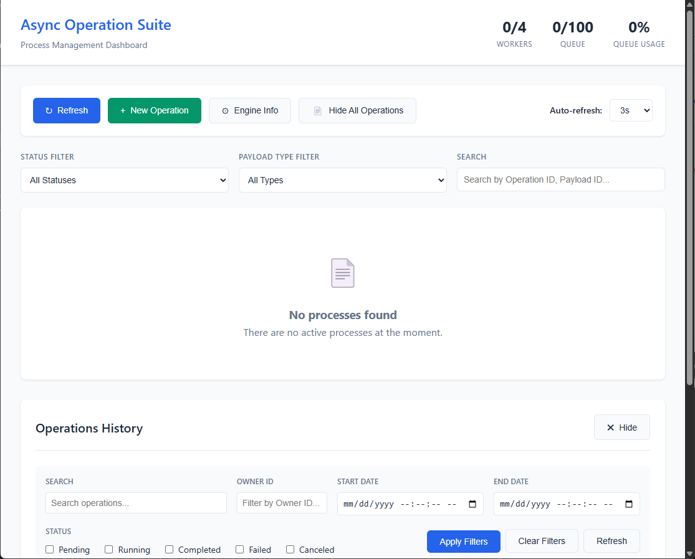
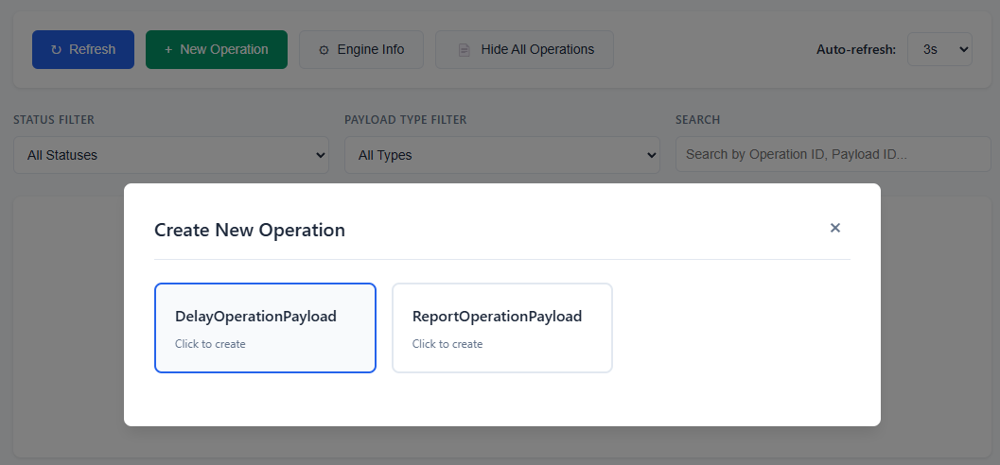
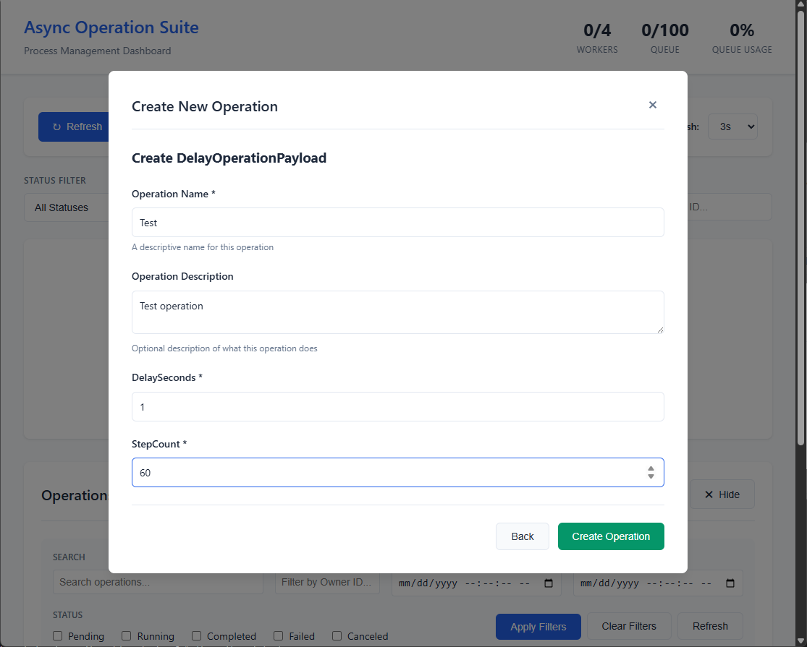
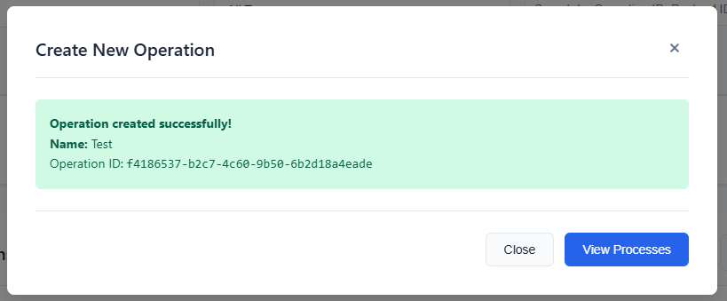
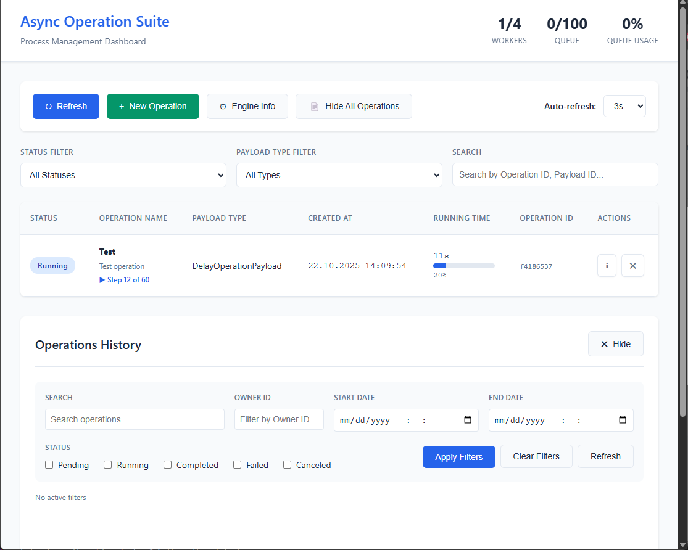
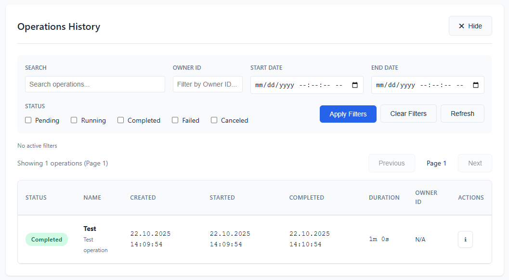
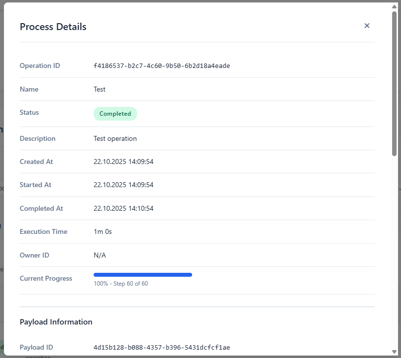
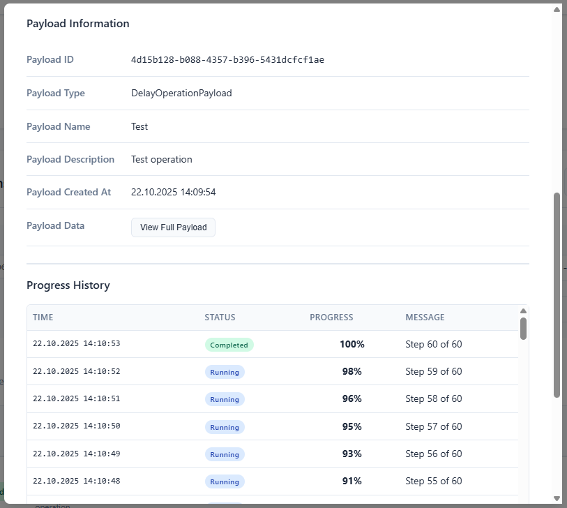
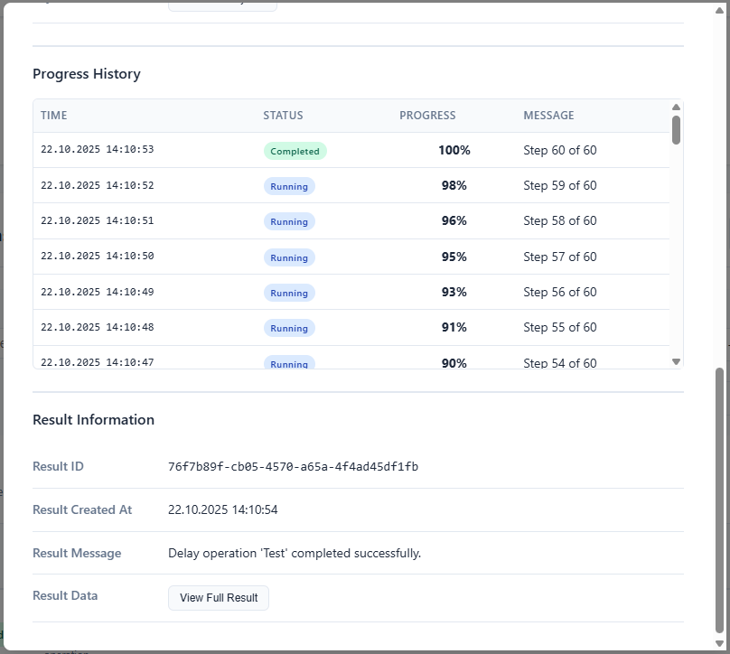
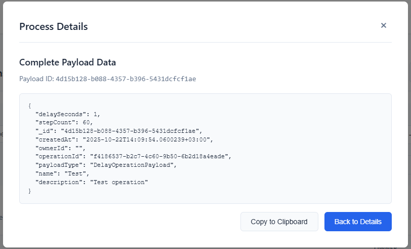

# Bazlama AsyncOperationSuite

A robust and scalable .NET library for managing and monitoring asynchronous operations with real-time progress tracking, result storage, and comprehensive operation management capabilities.

## Overview

Bazlama AsyncOperationSuite provides a complete solution for handling long-running asynchronous operations in .NET applications. It offers a structured approach to manage background tasks with features like progress tracking, result storage, operation queuing, and real-time monitoring through a web interface.

## Key Features

- **Asynchronous Operation Management**: Execute and monitor long-running background operations
- **Real-time Progress Tracking**: Track operation progress with detailed status updates
- **Multiple Storage Providers**: Support for Memory and SQL Server storage backends
- **Web API Integration**: RESTful API endpoints for operation management
- **Frontend Dashboard**: TypeScript-based web interface for monitoring operations
- **Configurable Workers**: Adjustable worker threads and queue management
- **Payload Constraints**: Control concurrent operations per payload type
- **Authentication Support**: JWT-based authentication integration
- **Operation Results**: Store and retrieve operation results with detailed metadata

## Architecture

The suite consists of two main packages:

### Core Package (`Bazlama.AsyncOperationSuite`)
- Operation processing engine
- Storage abstractions and implementations
- Configuration management
- Core models and services

### MVC Extension (`Bazlama.AsyncOperationSuite.Mvc`)
- ASP.NET Core controllers
- API endpoints for operation management
- Swagger/OpenAPI integration

## Screenshots

### Dashboard Overview


### Operation Details


### Progress Monitoring


### Active Operations


### Operation Results


### API Documentation


### Configuration Settings


### Real-time Updates


### Operation History


### Performance Metrics


## Quick Start

### 1. Installation

Install the NuGet packages:

```bash
dotnet add package Bazlama.AsyncOperationSuite
dotnet add package Bazlama.AsyncOperationSuite.Mvc
```

### 2. Basic Configuration

```csharp
using Bazlama.AsyncOperationSuite.Extensions;
using Bazlama.AsyncOperationSuite.Storage.MemoryStorage;
using Bazlama.AsyncOperationSuite.Mvc.Extensions;

var builder = WebApplication.CreateBuilder(args);

// Add AsyncOperationSuite services
builder.Services.AddAsyncOperationSuiteMemoryStorage();
builder.Services.AddAsyncOperationSuiteService(builder.Configuration);

// Add MVC controllers
builder.Services.AddControllers();
builder.Services.AddAsyncOperationSuiteMvcAllControllers(requireAuthorization: false);

var app = builder.Build();

app.UseHttpsRedirection();
app.UseAuthorization();
app.MapControllers();

app.Run();
```

### 3. Creating an Operation

```csharp
public class DelayOperationPayload : AsyncOperationPayloadBase
{
    public int DelaySeconds { get; set; } = 1;
    public int StepCount { get; set; } = 15;
}

public class DelayOperationProcessor : AsyncOperationProcess<DelayOperationPayload>
{
    public DelayOperationProcessor(
        DelayOperationPayload payload,
        AsyncOperation asyncOperation,
        AsyncOperationService asyncOperationService)
        : base(payload, asyncOperation, asyncOperationService)
    {
    }

    protected override async Task OnExecuteAsync(
        IServiceProvider serviceProvider,
        ILogger logger,
        CancellationToken cancellationToken)
    {
        for (var i = 0; i < Payload.StepCount; i++)
        {
            var progress = (i + 1) * 100 / Payload.StepCount;
            await PublishProgress($"Step {i + 1} of {Payload.StepCount}", progress, cancellationToken);
            await Task.Delay(Payload.DelaySeconds * 1000, cancellationToken);
        }

        SetResult("Completed", $"Operation '{Payload.Name}' completed successfully.");
    }
}
```

## Configuration

### Basic Configuration

```json
{
  "AsyncOperationSuiteConfiguration": {
    "WorkerCount": 5,
    "QueueSize": 1000,
    "PayloadConcurrentConstraints": {
      "DelayOperationPayload": 3,
      "ReportOperationPayload": 1
    }
  }
}
```

### Storage Options

#### Memory Storage
```csharp
builder.Services.AddAsyncOperationSuiteMemoryStorage();
```

#### SQL Server Storage
```csharp
builder.Services.AddAsyncOperationSuiteMSSQLStorage(builder.Configuration);
```

## API Endpoints

The MVC extension provides comprehensive REST API endpoints:

- `GET /api/operation/query` - Query operations with filtering
- `POST /api/operation/publish` - Publish new operations
- `GET /api/operation/payload` - Get registered payload types
- `GET /api/operation/active` - Get active operations
- `GET /api/operation/engine-info` - Get engine information

## Authentication

The suite supports JWT-based authentication:

```csharp
builder.Services.AddAuthentication(JwtBearerDefaults.AuthenticationScheme)
    .AddJwtBearer(options =>
    {
        options.TokenValidationParameters = new TokenValidationParameters
        {
            ValidateIssuer = true,
            ValidateAudience = true,
            ValidateLifetime = true,
            ValidateIssuerSigningKey = true,
            ValidIssuer = "yourdomain.com",
            ValidAudience = "yourdomain.com",
            IssuerSigningKey = new SymmetricSecurityKey(Encoding.UTF8.GetBytes("your_secret_key"))
        };
    });

// Require authorization for controllers
builder.Services.AddAsyncOperationSuiteMvcAllControllers(requireAuthorization: true);
```

## Frontend Integration

The project includes a TypeScript-based frontend client for real-time operation monitoring:

```typescript
import { AsyncOperationClient } from './AsyncOperationClient/AsyncOperationClient.ts'

const client = new AsyncOperationClient()
await client.init()

// Publish an operation
const result = await client.Publish("DelayOperationPayload", { 
    DelaySeconds: 1,
    StepCount: 10
})

// Monitor active processes
const activeProcesses = await client.getActiveProcesses()
```

## Sample Application

The repository includes a complete sample application demonstrating:

- API server setup with multiple operation types
- Frontend dashboard with real-time monitoring
- Authentication integration
- Storage configuration examples

## Requirements

- .NET 8.0 or later
- SQL Server (for SQL storage provider)
- Modern web browser (for frontend dashboard)

## License

This project is licensed under the MIT License.

## Contributing

Contributions are welcome! Please feel free to submit a Pull Request.

## Support

For issues and questions, please use the GitHub Issues page.

## Author

Murat Budun - [GitHub Profile](https://github.com/MuratBudun)