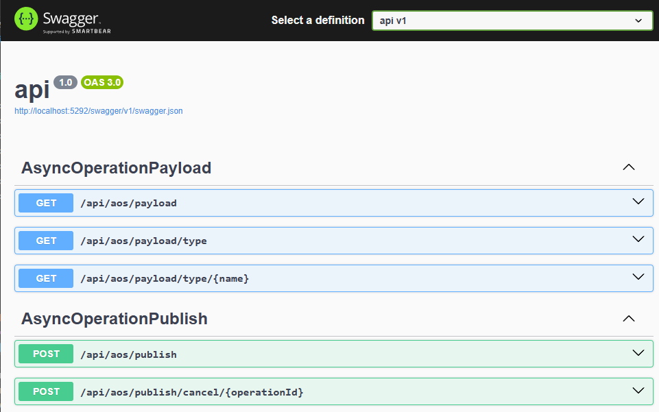

# Bazlama AsyncOperationSuite

A robust and scalable .NET library for managing and monitoring asynchronous operations with real-time progress tracking, result storage, and comprehensive operation management capabilities.

## Overview

Bazlama AsyncOperationSuite provides a complete solution for handling long-running asynchronous operations in .NET applications. It offers a structured approach to manage background tasks with features like progress tracking, result storage, operation queuing, and real-time monitoring through a web interface.

## Key Features

- **Asynchronous Operation Management**: Execute and monitor long-running background operations
- **Real-time Progress Tracking**: Track operation progress with detailed status updates
- **Multiple Storage Providers**: Support for Memory and SQL Server storage backends
- **Web API Integration**: RESTful API endpoints for operation management
- **Frontend Dashboard**: TypeScript-based web interface for monitoring operations
- **Configurable Workers**: Adjustable worker threads and queue management
- **Payload Constraints**: Control concurrent operations per payload type
- **Authentication Support**: JWT-based authentication integration
- **Operation Results**: Store and retrieve operation results with detailed metadata

## Architecture

The suite consists of two main packages:

### Core Package (`Bazlama.AsyncOperationSuite`)
- Operation processing engine
- Storage abstractions and implementations
- Configuration management
- Core models and services

### MVC Extension (`Bazlama.AsyncOperationSuite.Mvc`)
- ASP.NET Core controllers
- API endpoints for operation management
- Swagger/OpenAPI integration

## Screenshots

### Dashboard Overview


### Create New Operation


### Real-time Updates


### Operation History


### Process Details


### API Documentation



## Quick Start

### 1. Installation

Install the NuGet packages:

```bash
dotnet add package Bazlama.AsyncOperationSuite
dotnet add package Bazlama.AsyncOperationSuite.Mvc
```

### 2. Basic Configuration

```csharp
using Bazlama.AsyncOperationSuite.Extensions;
using Bazlama.AsyncOperationSuite.Storage.MemoryStorage;
using Bazlama.AsyncOperationSuite.Mvc.Extensions;

var builder = WebApplication.CreateBuilder(args);

// Add AsyncOperationSuite services
builder.Services.AddAsyncOperationSuiteMemoryStorage();
builder.Services.AddAsyncOperationSuiteService(builder.Configuration);

// Add MVC controllers
builder.Services.AddControllers();
builder.Services.AddAsyncOperationSuiteMvcAllControllers(requireAuthorization: false);

var app = builder.Build();

app.UseHttpsRedirection();
app.UseAuthorization();
app.MapControllers();

app.Run();
```

### 3. Creating an Operation

```csharp
public class DelayOperationPayload : AsyncOperationPayloadBase
{
    public int DelaySeconds { get; set; } = 1;
    public int StepCount { get; set; } = 15;
}

public class DelayOperationProcessor : AsyncOperationProcess<DelayOperationPayload>
{
    public DelayOperationProcessor(
        DelayOperationPayload payload,
        AsyncOperation asyncOperation,
        AsyncOperationService asyncOperationService)
        : base(payload, asyncOperation, asyncOperationService)
    {
    }

    protected override async Task OnExecuteAsync(
        IServiceProvider serviceProvider,
        ILogger logger,
        CancellationToken cancellationToken)
    {
        for (var i = 0; i < Payload.StepCount; i++)
        {
            var progress = (i + 1) * 100 / Payload.StepCount;
            await PublishProgress($"Step {i + 1} of {Payload.StepCount}", progress, cancellationToken);
            await Task.Delay(Payload.DelaySeconds * 1000, cancellationToken);
        }

        SetResult("Completed", $"Operation '{Payload.Name}' completed successfully.");
    }
}
```

## Configuration

### Basic AsyncOperationSuite Configuration

```json
{
  "AsyncOperationSuiteConfiguration": {
    "WorkerCount": 5,
    "QueueSize": 1000,
    "PayloadConcurrentConstraints": {
      "DelayOperationPayload": 3,
      "ReportOperationPayload": 1
    }
  }
}
```

### Storage Configuration Options

The AsyncOperationSuite supports multiple storage backends with comprehensive configuration options.

#### Memory Storage Configuration

Memory storage is ideal for development, testing, or applications that don't require persistence.

```json
{
  "AsyncOperationSuiteConfiguration": {
    "WorkerCount": 5,
    "QueueSize": 1000,
    "MemoryStorage": {
      "MaxOperations": 1000,
      "MaxPayloads": 1000,
      "MaxProgress": 5000,
      "MaxResults": 1000,
      "CleanupStrategy": "RemoveCompletedFirst",
      "CleanupBatchSize": 100,
      "EnableAutoCleanup": true,
      "CleanupThreshold": 0.9
    }
  }
}
```

**Memory Storage Options:**
- `MaxOperations`: Maximum operations to keep in memory (default: 100)
- `MaxPayloads`: Maximum payloads to keep in memory (default: 100)  
- `MaxProgress`: Maximum progress records to keep in memory (default: 1000)
- `MaxResults`: Maximum results to keep in memory (default: 100)
- `CleanupStrategy`: Strategy when limit is reached
  - `RemoveOldest`: Remove oldest items first
  - `RemoveCompletedFirst`: Remove completed operations first
  - `RemoveFailedFirst`: Remove failed operations first
  - `ThrowException`: Throw exception when limit reached
- `CleanupBatchSize`: Number of items to remove during cleanup (0 = auto 10%)
- `EnableAutoCleanup`: Enable automatic cleanup (default: true)
- `CleanupThreshold`: Cleanup trigger percentage (default: 0.9 = 90%)

#### SQL Server Storage Configuration

SQL Server storage provides persistence and is suitable for production environments.

```json
{
  "AsyncOperationSuiteConfiguration": {
    "WorkerCount": 5,
    "QueueSize": 1000,
    "MSSQLStorage": {
      "ConnectionString": "Data Source=localhost;Initial Catalog=AsyncOperationSuite;Integrated Security=true;TrustServerCertificate=True;",
      "CommandTimeout": 30,
      "EnableDetailedLogging": false,
      "MaxPoolSize": 100,
      "MinPoolSize": 5
    }
  }
}
```

**SQL Server Storage Options:**
- `ConnectionString`: SQL Server connection string
- `CommandTimeout`: Command timeout in seconds (default: 30)
- `EnableDetailedLogging`: Enable detailed SQL logging (default: false)
- `MaxPoolSize`: Maximum connection pool size (default: 100)
- `MinPoolSize`: Minimum connection pool size (default: 5)

#### Production Configuration Example

```json
{
  "AsyncOperationSuiteConfiguration": {
    "WorkerCount": 10,
    "QueueSize": 5000,
    "PayloadConcurrentConstraints": {
      "EmailOperationPayload": 5,
      "ReportGenerationPayload": 2,
      "DataImportPayload": 1,
      "BackupOperationPayload": 1
    },
    "MSSQLStorage": {
      "ConnectionString": "Data Source=prod-sql-server;Initial Catalog=AsyncOperationSuite;User ID=async_user;Password=your_secure_password;TrustServerCertificate=True;Connection Timeout=30;",
      "CommandTimeout": 60,
      "EnableDetailedLogging": false,
      "MaxPoolSize": 200,
      "MinPoolSize": 10
    }
  },
  "Logging": {
    "LogLevel": {
      "Default": "Information",
      "Bazlama.AsyncOperationSuite": "Information",
      "Microsoft.AspNetCore": "Warning"
    }
  }
}
```

### Storage Provider Setup

#### Memory Storage Setup
Memory storage is perfect for development and testing scenarios where persistence is not required.

```csharp
using Bazlama.AsyncOperationSuite.Extensions;
using Bazlama.AsyncOperationSuite.Storage.MemoryStorage;

var builder = WebApplication.CreateBuilder(args);

// Configure Memory Storage
builder.Services.AddAsyncOperationSuiteMemoryStorage(builder.Configuration);
builder.Services.AddAsyncOperationSuiteService(builder.Configuration);

var app = builder.Build();
```

#### SQL Server Storage Setup
SQL Server storage provides persistence and is recommended for production environments.

```csharp
using Bazlama.AsyncOperationSuite.Extensions;
using Bazlama.AsyncOperationSuite.Storage.MSSQLStorage;

var builder = WebApplication.CreateBuilder(args);

// Configure SQL Server Storage
builder.Services.AddAsyncOperationSuiteMSSQLStorage(builder.Configuration);
builder.Services.AddAsyncOperationSuiteService(builder.Configuration);

var app = builder.Build();
```

#### Hybrid Configuration
You can also configure both storage providers and choose which one to use based on environment:

```csharp
var builder = WebApplication.CreateBuilder(args);

if (builder.Environment.IsDevelopment())
{
    builder.Services.AddAsyncOperationSuiteMemoryStorage(builder.Configuration);
}
else
{
    builder.Services.AddAsyncOperationSuiteMSSQLStorage(builder.Configuration);
}

builder.Services.AddAsyncOperationSuiteService(builder.Configuration);
```

### Database Schema (SQL Server)

When using SQL Server storage, the following tables will be created automatically:

- `AsyncOperations`: Stores operation metadata and status
- `AsyncOperationPayloads`: Stores operation payload data
- `AsyncOperationProgress`: Stores progress updates
- `AsyncOperationResults`: Stores operation results

## Performance Considerations

### Memory Storage
- **Pros**: Ultra-fast operations, no network latency, ideal for development
- **Cons**: No persistence, limited by available RAM, data loss on restart
- **Use Cases**: Development, testing, temporary operations, caching scenarios

### SQL Server Storage  
- **Pros**: Full persistence, ACID compliance, scalable, production-ready
- **Cons**: Network latency, requires database infrastructure
- **Use Cases**: Production environments, audit requirements, long-term storage

### Scaling Guidelines

#### Worker Configuration
```json
{
  "AsyncOperationSuiteConfiguration": {
    "WorkerCount": 10,  // Adjust based on CPU cores and workload
    "QueueSize": 5000   // Adjust based on memory and peak load
  }
}
```

#### Payload Constraints
Control concurrent operations per type to prevent resource exhaustion:

```json
{
  "AsyncOperationSuiteConfiguration": {
    "PayloadConcurrentConstraints": {
      "CPUIntensiveOperation": 2,     // Limit CPU-heavy operations
      "IOIntensiveOperation": 10,     // Allow more I/O operations
      "DatabaseOperation": 5,         // Control database connections
      "EmailOperation": 20            // Network operations can be higher
    }
  }
}
```

## Monitoring and Observability

### Built-in Metrics
The suite provides comprehensive logging and metrics:

```csharp
// Enable detailed logging
"Logging": {
  "LogLevel": {
    "Bazlama.AsyncOperationSuite": "Debug",
    "Bazlama.AsyncOperationSuite.Services": "Information"
  }
}
```

### Health Checks
Monitor system health with built-in endpoints:

```csharp
builder.Services.AddHealthChecks()
    .AddAsyncOperationSuiteHealthCheck();
```

### Custom Metrics Integration
Integrate with your monitoring solution:

```csharp
// Example with Application Insights
builder.Services.AddApplicationInsightsTelemetry();
builder.Services.AddAsyncOperationSuiteService(builder.Configuration);
```

## Security Considerations

### Connection String Security
Always secure your connection strings:

```csharp
// Use Azure Key Vault or similar for production
builder.Configuration.AddAzureKeyVault(/* configuration */);

// Or use environment variables
"ConnectionStrings": {
  "AsyncOperationSuite": "#{AsyncOperation_ConnectionString}#"
}
```

### Authentication & Authorization
Implement proper security controls:

```csharp
// JWT Authentication
builder.Services.AddAuthentication(JwtBearerDefaults.AuthenticationScheme)
    .AddJwtBearer(options => { /* configuration */ });

// Require authorization for all controllers
builder.Services.AddAsyncOperationSuiteMvcAllControllers(requireAuthorization: true);

// Or selective authorization
builder.Services.AddAsyncOperationSuiteMvcOperationPublish(requireAuthorization: true);
builder.Services.AddAsyncOperationSuiteMvcOperationQuery(requireAuthorization: false);
```

### Data Protection
- Always use HTTPS in production
- Encrypt sensitive payload data
- Implement proper input validation
- Use SQL injection protection (built-in with parameterized queries)

## API Endpoints

The MVC extension provides comprehensive REST API endpoints:

- `GET /api/operation/query` - Query operations with filtering
- `POST /api/operation/publish` - Publish new operations
- `GET /api/operation/payload` - Get registered payload types
- `GET /api/operation/active` - Get active operations
- `GET /api/operation/engine-info` - Get engine information

### API Usage Examples

#### Publishing an Operation
```bash
POST /api/operation/publish
Content-Type: application/json

{
  "payloadType": "DelayOperationPayload",
  "payload": {
    "Name": "Test Operation",
    "Description": "Test operation description",
    "DelaySeconds": 5,
    "StepCount": 10
  }
}
```

#### Querying Operations
```bash
GET /api/operation/query?status=Running&pageSize=10&pageNumber=1
```

#### Getting Active Operations
```bash
GET /api/operation/active
```

## Authentication

The suite supports JWT-based authentication:

```csharp
builder.Services.AddAuthentication(JwtBearerDefaults.AuthenticationScheme)
    .AddJwtBearer(options =>
    {
        options.TokenValidationParameters = new TokenValidationParameters
        {
            ValidateIssuer = true,
            ValidateAudience = true,
            ValidateLifetime = true,
            ValidateIssuerSigningKey = true,
            ValidIssuer = "yourdomain.com",
            ValidAudience = "yourdomain.com",
            IssuerSigningKey = new SymmetricSecurityKey(Encoding.UTF8.GetBytes("your_secret_key"))
        };
    });

// Require authorization for controllers
builder.Services.AddAsyncOperationSuiteMvcAllControllers(requireAuthorization: true);
```

## Frontend Integration

The API works seamlessly with any frontend framework. Example using JavaScript/TypeScript:

```typescript
// Publish an operation
const response = await fetch('/api/aos/publish?payloadType=DelayOperationPayload', {
    method: 'POST',
    headers: {
        'Content-Type': 'application/json',
        'Authorization': 'Bearer YOUR_JWT_TOKEN'
    },
    body: JSON.stringify({
        Name: 'My Operation',
        DelaySeconds: 5,
        StepCount: 10
    })
});

const result = await response.json();
console.log('Operation ID:', result.operationId);

// Poll for progress
const progressResponse = await fetch(`/api/aos/query/operation/${result.operationId}/progress`);
const progress = await progressResponse.json();
console.log('Progress:', progress.percentage);
```

## Sample Application

The repository includes a complete sample application demonstrating:

- API server setup with multiple operation types
- Frontend dashboard with real-time monitoring
- Authentication integration
- Storage configuration examples

### Running the Sample Application

To run the sample API application:

```bash
cd sample/api
dotnet run
```

The API will be available at `https://localhost:5292` and includes:
- Interactive Swagger documentation at `/swagger`
- Real-time operation monitoring dashboard
- Sample operation types for testing

## Troubleshooting

### Common Issues

#### "Unable to resolve service for type 'AsyncOperationService'"
Make sure you've registered the service:
```csharp
builder.Services.AddAsyncOperationSuiteService(builder.Configuration);
```

#### "Failed to add operation process to the dictionary"
This indicates duplicate operation IDs. Ensure each operation has a unique ID:
```csharp
// AsyncOperationPayloadBase automatically generates unique IDs
public class MyPayload : AsyncOperationPayloadBase
{
    // Your properties
}
```

#### Memory Storage Cleanup Issues
Adjust cleanup configuration for your workload:
```json
{
  "AsyncOperationSuiteConfiguration": {
    "MemoryStorage": {
      "MaxOperations": 5000,
      "CleanupThreshold": 0.8,
      "CleanupStrategy": "RemoveCompletedFirst"
    }
  }
}
```

#### SQL Server Connection Issues
Verify your connection string and database permissions:
```json
{
  "AsyncOperationSuiteConfiguration": {
    "MSSQLStorage": {
      "ConnectionString": "...",
      "CommandTimeout": 60,
      "EnableDetailedLogging": true
    }
  }
}
```

### Best Practices

#### Operation Design
- Keep operations idempotent when possible
- Implement proper cancellation token handling
- Use progress reporting for long-running operations
- Set meaningful operation names and descriptions

#### Performance Optimization
- Configure worker count based on your CPU cores
- Set appropriate payload constraints
- Use SQL Server storage for production environments
- Monitor queue size and adjust accordingly

#### Error Handling
```csharp
protected override async Task OnExecuteAsync(
    IServiceProvider serviceProvider,
    ILogger logger,
    CancellationToken cancellationToken)
{
    try
    {
        // Your operation logic
        await PublishProgress("Processing...", 50, cancellationToken);
        
        // Set success result
        SetResult("Success", "Operation completed successfully");
    }
    catch (OperationCanceledException)
    {
        // Handle cancellation gracefully
        logger.LogWarning("Operation was cancelled");
        throw; // Re-throw to maintain cancellation behavior
    }
    catch (Exception ex)
    {
        // Log and handle errors
        logger.LogError(ex, "Operation failed");
        throw; // Framework will handle error state
    }
}
```

## Requirements

- .NET 8.0 or later
- SQL Server (for SQL storage provider)
- Modern web browser (for frontend dashboard)

## License

This project is licensed under the MIT License.

## Contributing

Contributions are welcome! Please feel free to submit a Pull Request.

## Support

For issues and questions, please use the GitHub Issues page.

## Author

Murat Budun - [GitHub Profile](https://github.com/MuratBudun)